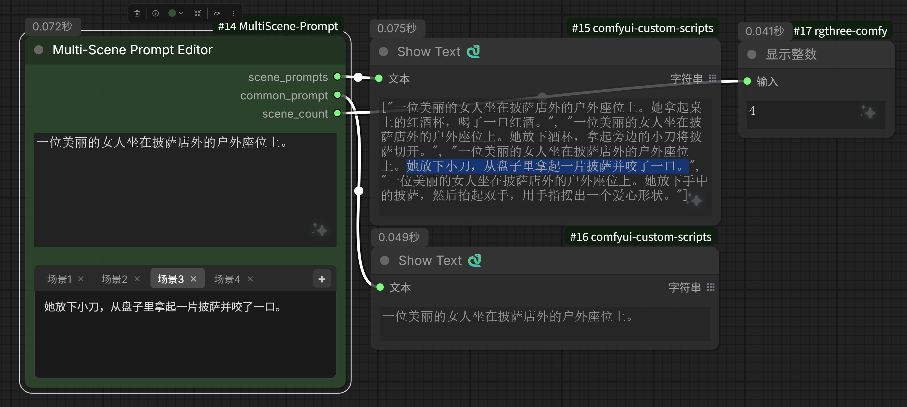

# ComfyUI-MultiScene-Prompt

多段、分段提示词可视化编辑节点，可动态增、减场景数量。适合搭配 Wan2.2 + SVI 长镜头视频生成工作流使用。

## 功能特性

- **标签式界面**：以标签页形式管理多个场景的提示词，切换流畅
- **动态增删**：通过 `+` 按钮添加场景，点击 `×` 删除场景
- **公用提示词**：所有场景共享的基础提示词，自动合并到每个场景
- **可视化编辑**：直观的文本输入框，实时编辑场景提示词
- **JSON 输出**：输出格式化的 JSON 数组，便于下游节点处理
  


## 安装方法

### 方法一：通过 ComfyUI Manager（推荐）

1. 打开 ComfyUI Manager
2. 点击 "Install Custom Nodes"
3. 搜索 `ComfyUI-MultiScene-Prompt`
4. 点击安装

### 方法二：手动安装

```bash
cd ComfyUI/custom_nodes
git clone https://github.com/mailzwj/ComfyUI-MultiScene-Prompt.git
```

安装完成后重启 ComfyUI。

## 使用方法

### 节点接口

| 输入 | 类型 | 说明 |
|------|------|------|
| `common_prompt` | STRING | 公用提示词，所有场景共享的基础内容 |

| 输出 | 类型 | 说明 |
|------|------|------|
| `scene_prompts` | STRING | JSON 数组，包含合并后的所有场景提示词 |
| `common_prompt` | STRING | 公用提示词（直通） |
| `scene_count` | INT | 场景数量 |

### 操作流程

1. **输入公用提示词**：在 `common_prompt` 输入框中输入所有场景共享的基础提示词

2. **添加场景**：点击右上角的 `+` 按钮添加新场景

3. **编辑场景提示词**：
   - 点击场景标签（场景 1、场景 2...）切换场景
   - 在文本框中输入该场景特有的提示词

4. **删除场景**：点击场景标签上的 `×` 按钮删除（仅当一个场景时不可删除）

5. **获取输出**：`scene_prompts` 输出为 JSON 数组，每个元素是 `common_prompt + scene_prompt` 的合并结果

### 示例

**输入：**
```
common_prompt: "一个美丽的城市，白天，高清，4K"

场景 1: "，有摩天大楼"
场景 2: "，有公园和湖泊"
场景 3: "，有海滩和海洋"
```

**输出（scene_prompts）：**
```json
[
  "一个美丽的城市，白天，高清，4K，有摩天大楼",
  "一个美丽的城市，白天，高清，4K，有公园和湖泊",
  "一个美丽的城市，白天，高清，4K，有海滩和海洋"
]
```

## 界面说明

```
┌────────────────────────────────────────┐
│ 公用提示词输入框                       │
├────────────────────────────────────────┤
│ [场景 1] [场景 2] [场景 3] [+]	← 标签栏
│                                        │
│ 场景提示词输入框                       │
│                                        │
│                                        │
└────────────────────────────────────────┘
```

### 标签栏功能

- **场景标签**：点击切换编辑对应场景
- **`+` 按钮**：添加新场景（自动切换到新场景）
- **`×` 按钮**：删除对应场景（鼠标滚轮可横向滚动查看）

## 适用场景

- **长镜头视频生成**：为 Wan2.2 + SVI 工作流生成多段连贯提示词
- **分镜脚本**：管理多个镜头的提示词
- **批量生成**：一次配置多个变体，逐个生成

## 技术细节

- **节点类别**：`prompt`
- **节点名称**：`Multi-Scene Prompt Editor`
- **数据格式**：内部使用 JSON 数组存储场景数据

## 许可证

Apache-2.0

## 链接

- **仓库**：[https://github.com/mailzwj/ComfyUI-MultiScene-Prompt](https://github.com/mailzwj/ComfyUI-MultiScene-Prompt)
